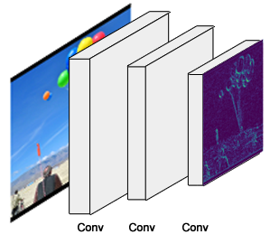

# 实例分割 - 基于 Mask R-CNN 和 TensorFlow

今年11月，我们开源了我们对 [Mask R-CNN 的实现源码](https://github.com/matterport/Mask_RCNN)。自那以后，我们的项目被fork了1400次，同时被应用在多个项目中，并且有许多的开发者对项目源码作出了改进。同时，我们也收到了许多关于我们项目的问题，所以在这篇文章中，我将阐述一下我们对 Mask R-CNN 的实现细节并展示它在实际项目中的应用。

本篇文章将覆盖以下两个内容：
1. Mask R-CNN 的概述。 
2. 如何从零开始训练一个数据模型并搭建一个图片颜色渲染滤镜。

> **代码提示:**
*这是本篇文章展示项目的[全部代码](https://github.com/matterport/Mask_RCNN/tree/master/samples/balloon)，包括我创建的数据集和训练后的模型。*

## 什么是实例分割?
实例分割的任务就是，以像素为单位，识别图片中物体的轮廓。实力分割属于计算机视觉中最难实现的功能之一。以下是图像识别中和实例分割相关的几个任务，和他们处理后出来的结果：


- **图像分类 (Classification)**: 图片中有气球。
- **语义分割 (Semantic Segmentation)**: 这些是图片中组成所有气球的像素。
- **目标检测 (Object Detection)**: 这里是图片中7个气球的位置。我们需要识别被遮挡的物体。
- **实例分割 (Instance Segmentation)**: 这是是图片中7个气球的位置，包括组成每一个气球的像素。

## Mask R-CNN
Mask R-CNN (Regional Convolutional Neural Network: 区域卷积神经网络)，是一个分为两个主要步骤的框架：第一步，扫描整张图片，并生成可能包含所找实例的所有区域。第二步，将上一步生成的区域进行分类并生成边界框和蒙层

[Mask R-CNN](https://arxiv.org/abs/1703.06870) 是基于 [Faster R-CNN](https://arxiv.org/abs/1506.01497) 基础上的拓展，而且是由同一作者于去年发布。Faster R-CNN 是一个用于目标检测 (Object Detection) 的框架，而 Mask R-CNN 则是在这个基础上拓展出了实例分割 (Instance Segmentation) 与其他的新功能。


整体上，Mask R-CNN 可以分为以下几个模块：

## 1. 骨干网络 (Backbone)


如图所示，是一个用常规的卷积神经网络实现的特征提取器，通常是采用的 ResNet50 或 ResNet101。神经网络前面的层级查找底层特征(图像的边缘与角)，接下来后面的层级会继续查找更高层级的特征(车、人、天空)。

通过骨干网络的处理，输入为 1024\*1024px\*3(RGB) 的图片会被转化成 32\*32\*2048 的特征点矩阵。输出的特征点矩阵就是我们后面步骤的输入。

> **代码提示:**
*骨干网络的构造在 [resnet_graph()](https://github.com/matterport/Mask_RCNN/blob/master/mrcnn/model.py#L171) 方法中实现。代码同时支持 ResNet50 和 ResNet101.*

### 特征金字塔网络 (Feature Pyramid Network)


由 Mask R-CNN 的作者提出的 [特征金字塔网络 (FPN)](https://arxiv.org/abs/1612.03144) 是基于上述骨干网络的优化。和骨干网络相比，FPN 可以在不同的层级更精准地表现出物体。

如图，在骨干网络的基础上，FPN 增加了另外一个金字塔结构，将高层级的输出特征传递到低层级。通过这种方式，每个层级都可以访问它的上一层或下一层特征。

我们 Mask RCNN 的实现采用的是 ResNet101 + FPN 作为骨干网络。

>**代码提示：**
>FPN 的构建是在 ResNet 的创建之后，在 [MaskRCNN.build()](https://github.com/matterport/Mask_RCNN/blob/master/mrcnn/model.py#L1840) 方法中实现。
常规的骨干网络会输出单独一组特征矩阵，与此相比，RPN 会在新增金字塔的每一层分别产生一组特征矩阵。在使用中，我们会根据物体像素尺寸，动态地选择使用哪一组特征矩阵。在后面的文章中，我会直接描述成骨干网络的特征矩阵输出。但是请记住，使用 FPN 时，我们会得到多组特征矩阵输出，而我们会在其中挑选一组使用。*

## 2. 区域提议网络 (Region Proposal Network 下面简称 RPN )


RPN 是一个通过使用滑动窗口方式扫描图片，以挖掘出含有物体区域的轻量级神经网络。

RPN 扫描出的区域,我们称为锚点。这些锚点在图上表现出来的就是一个个盒子(box)，如上图所示，即使这已经是简化过的图片。实际上，这些锚点能多达 200k 个，并且是不同尺寸，不同宽高比的。它们会重叠在一起，以尽可能多地覆盖图片。 

RPN 扫描出这么多的锚点，可以多快呢？事实上,相当快.这些滑动的窗口被RPN的卷积特性所处理, RPN 能在 GPU 上并行地扫描所有区域。更进一步，RPN并不是直接地扫描整张图片（虽然图例上我们是直接画出这些锚点）。相反， RPN 是通过 扫描骨干特征图（backbone feature map ） 得到锚点的。而这一的操作的目的是为了让 RPN 高效复用已经提取出的特征，以及避免重复的计算。根据 [Faster RCNN paper](https://arxiv.org/abs/1506.01497) 介绍， RPN 在这些优化下，能在 10 ms 内得到锚点。而在 Mask RCNN 中，我们通常会使用尺寸更大的图片以及更多的锚点，所以训练时间上可能会更久一点。

> **代码提示：**
> rpn 网络构建代码在 [`model.rpn_graph`](https://github.com/diaoxinqiang/Mask_RCNN/blob/e4b922624f0bd239607e7eeac79fa8dcab47b8b7/mrcnn/model.py) 方法中，可以在 [config.py](https://github.com/diaoxinqiang/Mask_RCNN/blob/e4b922624f0bd239607e7eeac79fa8dcab47b8b7/mrcnn/config.py) 文件中修改 `RPN_ANCHOR_SCALES` 以及   `RPN_ANCHOR_RATIOS` 参数改变锚点尺寸以及宽高比。

RPN 会为每个锚点生成两个输出:

1. 锚点类型（ Anchor Class ）: 前景类型 或 背景类型。前景类型就好比是一个在盒子里的物体。
2. 精细的边界框：一个前景锚点（也可以叫正极锚点）可能不会非常完美地定位在检测物体的中心位置上，所以 RPN 会估计一个估算出一个增量（ delta ，即针对矩形的x ,y , width , height 的百分比 ）来修正锚点盒子（ anchor box ）以更好地贴合检测物体。


在 RPN 预测过程中，我们会选择最可能包含物体的锚点，然后去修正它们的位置以及尺寸。如果有些锚点重叠得太多，我们会保留前景得分最高的一个，而其他的锚点就丢弃掉（这种方式成为非最大抑制 Non-max Suppression ）。在我们得到最终的提议区域（也就是我们感兴趣的区域 regions of interest,简称 ROI）之后，我们就能进入下一阶段。

> **代码提示:**
> [`ProposalLayer`](https://github.com/matterport/Mask_RCNN/blob/master/mrcnn/model.py#L255) 是使用自定义的 Keras 层构建的， 用来读取 RPN的输出结果，选择得分最高的锚点以及进行边界框修正。

## 3. 感兴趣区域(ROI)分类器 与 边界框回归器
在这一步，我们将处理由上一步 RPN 输出的感兴趣区域(ROIs)。和 RPN 类似，这一步骤将为每个感兴趣区域产生以下两个输出：


1. **类型：** 感兴趣区域中物体的类型。和 RPN 输出的前景和背景类型不一样的是，这一层网络会更进一步，能够将区域分类成具体的类型（人、车、椅子...等等）。这一层同样有可能会生成背景类型，而这种背景类型意味着丢弃该感兴趣区域。

2. **边界框优化：** 这一部分和 RPN 中边界框的处理很相似，它的作用主要是通过进一步地优化边界框的位置和尺寸来描绘出物体轮廓。

> 代码提示：
>  类器与边界框回归器时在[fpn_classifier_graph()](https://github.com/matterport/Mask_RCNN/blob/master/mrcnn/model.py#L901) 方法中创建的。

### 感兴趣区域的池化 (ROI Pooling)
在进行感兴趣区域分类之前，我们需要先解决一个小问题：因为这一步的分类器通常要求的输入是一个固定的尺寸，它并不能很好地处理不同尺寸的输入。然而，在 RPN 中的边界框优化步骤中，感兴趣区域会有不一样的尺寸。因为这个原因，我们需要引入 ROI Pooling。

*图片说明：为了让大家更容易理解，在上图中展示了浅层特征图的处理流程。*

感兴趣区域池化(ROI Pooling)，是指将特征图的一部分进行裁剪，然后转变成一个固定的尺寸。原理上和裁剪图片并改变图片尺寸一样（但两者在实现的细节上是有差别的）。


Mask R-CNN 的作者提出了一种叫 ROIAlign 的方法，这个方法会在特征图上的不同点进行取样并进行双线性插值。但是在我们的实现中，我们使用了 TensorFlow 中的 [crop_and_resize](https://www.tensorflow.org/api_docs/python/tf/image/crop_and_resize) 方法，因为这样更加简洁而且能满足大部分的需求。

>代码提示：感兴趣区域池化 (ROI Pooling) 的相关实现在 [PyramidROIAlign](https://github.com/matterport/Mask_RCNN/blob/master/mrcnn/model.py#L344) 中。

## 4. 图片分割蒙层
完成上一个章节的步骤，其实我们已经得到了一个可实现物体检测的 [Faster R-CNN](https://arxiv.org/abs/1506.01497) 框架。下面介绍的蒙层网络是 Mask R-CNN 论文里面额外介绍的功能实现。


蒙层的分支是一个卷积网络。这个卷积网络将 感兴趣区域分类器 里面选择出来的正确区域作为输入，并生成分辨率为 28px*28px 的蒙层。虽然生成的蒙层分辨率低，但是他们为浮点类型，所以比 binary mask 能储存更多的细节信息。同时，小的蒙层尺寸可以保证蒙层分支的轻量。在训练时，我们会将真实的蒙层缩小至 28px*28px，用来计算损失。然后在推断的过程中，我们把预算的蒙层放大成 ROI 边界框的大小，以此来得到每一个物体的蒙层。

>代码提示：蒙层分支的相关代码在 [build_fpn_mask_graph()](https://github.com/matterport/Mask_RCNN/blob/master/mrcnn/model.py#L957) 中。

## 一起来构造一个颜色渲染滤镜
和其他大多数有图片滤镜的图片编辑应用不同的是，我们的滤镜加了点人工智能，会更聪明一点：它会自动地找到特定的物体。如果你将这个滤镜在视频中使用，而不是单单一张图片，甚至会更有效果。


#### 1. 训练数据集
一般来说，我会从搜索包含我需要的物体的公开数据集开始。但在这个示例中，我想要把这个过程都记录夏日，以展示如何从零开始中构建一个数据集。
我从 `flickr` 中搜索关于气球的图片，并且这些图片是限定在"商业用户 & 允许修改"的许可证下。这个搜索结果得到的图片已经能满足我的需求了。我一共挑选了75张图片，并且它们分成训练集以及验证集。找图片是挺简单的事情，但标注图片才是艰难的部分。


等等，难道我们不是应该需要上百万的图片去训练深度学习模型的吗？有时候，你确实需要如此，但是更多情况下，你并不需要这么多图片。我主要依靠下面两点来显著地降低训练要求。

 第一点：**迁移学习**。
简单来说，不是使用从零训练一个模型，而是已经使用 `COCO` 数据集训练得到的模型参数中开始训练（我们在 `github` 代码库中有提供）。即使 `COCO`数据集中并不包含气球这一类型，但它包含了其他类型的图片（约 120K ）,这些图片训练得来的参数已经学习到了很多在自然图片中常见的特征，而这些特征是非常有用的。

第二点：这里只是给出简单的使用示例，所以在这个模型中我并不需要很高的精准度，所以，小小的数据集应该就能满足这一点了。

有非常多的工具能标注图片。我最终决定使用 `VIA`(`VGG Image Annotator`),因为它的简单性。它只需要下载一些 `HTML`文件，然后在浏览器中打开即可。一开始标注数据会非常慢，但是之后我熟悉了它的界面，标注一个气球的时间久只需大概需要一分钟。

如果你不喜欢使用`VIA`工具，下面还有一些我测试过的标注工具：
1. [`LAbelMe`](http://labelme.csail.mit.edu/): 一个最出名的标注工具，但是它的UI响应速度有点慢，特别是在放大大尺寸图片的时候。

2. `RectLabel`: 更大型的标注项目来说，是非常棒的。针对标注任务的不同类型，有多种可选项

3. `LabelBox`: 对更大有点的标注项目来说，是非常实用的。它有针对不同类型标注任务的选项设置。

4. `VGG Image Annotator (VIA)`: 快速，轻量，设计相当好。这是我最终决定使用的工具。

5. `COCO UI`: 这个工具过去常常用来标注 `COCO` 数据集。


## 加载数据集 
现在并没有通用的格式去存储分割蒙层，有些数据集将它们保存为 PNG 图片，有些把它们保存为多边形的坐标点。为了处理这种情况，我们的方案是提供一个 `Dataset` 类，你去继承它，然后复写一些方法去读取你所遇到的数据。
`VIA` 工具将标注数据保存在一个 `JSON`文件中，每一个蒙层都是多边形坐标点集合。虽然我没有找到这种格式的说明文档，但是通过查看生成的`JSON`文件，你很容易就能搞清楚是怎么回事。我在代码中添加了注释，以说明这些数据的转换是如何完成的。
> 代码提示：
一个最简单的读取新数据集的方式就是：复制[`coco.py`](https://github.com/matterport/Mask_RCNN/blob/master/samples/coco/coco.py),然后根据你的需求去修改它。[`balloons.py`](https://github.com/matterport/Mask_RCNN/blob/v2.1/samples/balloon/balloon.py)就是这么做得到的。

我的`BalloonDataset`类就像是这样的： 
```
class BalloonDataset(utils.Dataset):
    def load_balloons(self, dataset_dir, subset):
        ...
    def load_mask(self, image_id):
        ...
    def image_reference(self, image_id):
        ...
```
`load_balloons`是用来读取 `JSON`文件，提取标注数据，以及递归地调用`add_class` 和`add_image`内部方法以构建数据集。

`load_mask` 会通过绘制多边形，为图片中每个气球生成 `bitmap` 蒙层。
load_mask generates bitmap masks for every object in the image by drawing the polygons.
`image_reference`只是简单地为每张图片返回作为一个唯一标识的字符串，目的是为了 debug 。这个字符串其实就是图片文件名。

你也许注意到了我的类中没有包含加载图片或返回边界框的方法。其实用于加载图片的`load_image`方法已经在基类`Dataset`中有实现了。而边界框是动态地从蒙层中生成的。

## 校验数据
为了校验实现的代码是否正确，我新建了一个`Juyter notebook`。这个文件会加载数据集，能可视化蒙层以及边界框，以及能看到锚点已校验我的锚点尺寸是否匹配我要检测物体的尺寸，下面的日子是你期待看到的：


> **代码提示：**
为了创建这个 `notebook`,我复制了[`inspect_data.ipynb`](https://github.com/matterport/Mask_RCNN/blob/master/samples/coco/inspect_data.ipynb),然后修改顶部的代码块去加载气球数据集。


## 配置文件 
这个项目的配置参数和用来训练 `COCO`数据集的配置是相似的，所以我只需要复写三个参数而已。当我写 `Dataset`类时，我集成了Config基类，然后复写了下面的内容：
```
class BalloonConfig(Config):
    # Give the configuration a recognizable name
    NAME = "balloons"
    # Number of classes (including background)
    NUM_CLASSES = 1 + 1  # Background + balloon
    # Number of training steps per epoch
    STEPS_PER_EPOCH = 100
```
基本的配置使用了尺寸为 1024x1024 px 的输入图片，这是为了最好的准确度。我也沿用了这个配置，虽然我训练的图片尺寸会稍微小一点，但是模型会自动调整图片大小
> **代码提示：**
基础配置类在  [config.py](https://github.com/matterport/Mask_RCNN/blob/master/mrcnn/config.py) 文件中，而`BalloonConfig` 在 [balloons.py](https://github.com/matterport/Mask_RCNN/blob/v2.1/samples/balloon/balloon.py#L61) 文件中

## 训练
`Mask R-CNN`是一个相当大的模型，特别是我们使用了 `ResNet101`以及 `FPN` 来实现它。所以你需要有 12G 内存的先进 GPU 。当然内存小一点也可能行，但是我没有试过。我使用了 `Amazon` P2实例去训练模型，因为数据集比较小，训练时间只花了不到一个小时。
在`balloon`目录下，使用下面的命令行开始训练，这里我们应该从`COCO`预训练模型参数开始，代码会自动从我们仓库下载这个参数：
```
python3 balloon.py train --dataset=/path/to/dataset --model=coco
```
从终止训练后，再恢复训练的命令行：
```
python3 balloon.py train --dataset=/path/to/dataset --model=last
```
> **代码提示：**
除了 [balloons.py](https://github.com/matterport/Mask_RCNN/blob/v2.1/samples/balloon/balloon.py) 外，代码库中还有其他三个示例。
>  [train_shapes.ipynb](https://github.com/matterport/Mask_RCNN/blob/master/samples/shapes/train_shapes.ipynb):训练用户检测几何图形的一个玩具模型
> [coco.py](https://github.com/matterport/Mask_RCNN/blob/master/samples/coco/coco.py) : 用于训练 `COCO`数据集
>[nucleus.py](https://github.com/matterport/Mask_RCNN/tree/master/samples/nucleus) :在显微镜图片中分割识别细胞核


## 模型训练结果 
[inspect_balloon_model](https://github.com/matterport/Mask_RCNN/blob/v2.1/samples/balloon/inspect_balloon_model.ipynb) notebook 会显示模型训练后的结果。在 notebook 中可以看到训练结果的细节，并且同时还能按步骤了解到检测识别的过程。

> **代码提示：**
 [inspect_mode.ipynb](https://github.com/matterport/Mask_RCNN/blob/master/samples/coco/inspect_model.ipynb) 提供了对 `COCO`数据集的可视化以及`debug`的代码，而 [inspect_balloon_model.ipynb](https://github.com/matterport/Mask_RCNN/blob/v2.1/samples/balloon/inspect_balloon_model.ipynb) 只是 [inspect_mode.ipynb](https://github.com/matterport/Mask_RCNN/blob/master/samples/coco/inspect_model.ipynb) 的简化版本

## 色彩滤镜 
最终我们会得到物体的形状蒙层，可以通过它们做出色彩滤镜的效果。使用方法很简单：将一张带色彩的图片转化成灰度图，然后利用物体的形状蒙层把物体识别标记出来，接着从带色彩的原始图片中将色彩映射过来。下面是效果图：


> **代码提示：**
做出这种效果是 [color_splash()]的方法(https://github.com/matterport/Mask_RCNN/blob/v2.1/samples/balloon/balloon.py#L201) ，而 [detect_and_color_splash()](https://github.com/matterport/Mask_RCNN/blob/v2.1/samples/balloon/balloon.py#L221) 方法是用来处理加载图片，进行实例分割，以及应用色彩滤镜的整个流程。

## 答疑：
*  **问题：** 我想要更深入探索并且理解其中的细节，我应该看什么内容呢？
**回答：** 可以按照整个顺序阅读这几篇论文：[RCNN (pdf)](http://citeseerx.ist.psu.edu/viewdoc/download;jsessionid=AF8817DD0F70B32AA08B2ECBBA8099FA?doi=10.1.1.715.2453&rep=rep1&type=pdf) , [Fast RCNN](https://arxiv.org/abs/1504.08083), [Faster RCNN](https://arxiv.org/abs/1506.01497), [FPN](https://arxiv.org/abs/1612.03144),[ Mask RCNN](https://arxiv.org/abs/1703.06870)。
* **问题：**  我有许多问题可以在哪里提问呢？
**回答：** 在 [Issues page on GitHub](https://github.com/matterport/Mask_RCNN/issues) 页面中，大家都挺活跃的，你可以在这里提问题，同时也可以报告 issue。也可以先搜索一下已经关闭的 issue ，万一你的问题别人已经提过而我们恰好也回答了呢？

* **问题：** 我可以为这个项目做贡献吗？
**回答：** 这太好了，非常欢迎你 `Pull Request`

* **问题：** 我可以加入你的团队，做这样有趣又有意义的项目吗？
**回答：** 可以，我们在招聘关于 `deep learning`以及 `computer version` 相关的岗位，可以在这个[网站](https://matterport.com/careers/)上申请职位。

> **译者介绍：**

> [Xxxxxb_](https://github.com/XiongbinZhao) ：加拿大多伦多大学计算机硕士毕业，目前就职于百度。


> [GoodWillHunting_D](https://github.com/diaoxinqiang): 深度学习入门中，公司K12项目在深度应用该框架。


> **翻译目的：** 
让更多人有机会了解以及应用 Mask_RCNN 这么优秀的神经网络，并且该项目非常适合动手入门。同时，Mask_RCNN 论文（2017年 ICCV Best Paper Award ），第一作者是广东人 [**何凯明**](http://kaiminghe.com/)大神， [Xxxxxb_](https://github.com/XiongbinZhao)和我也是广东人，算是一种缘分。
